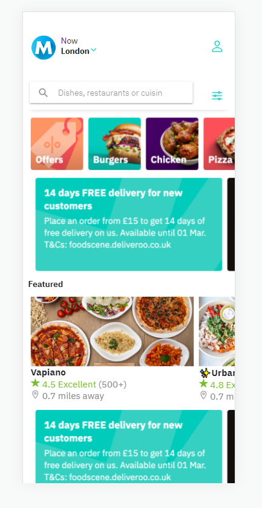
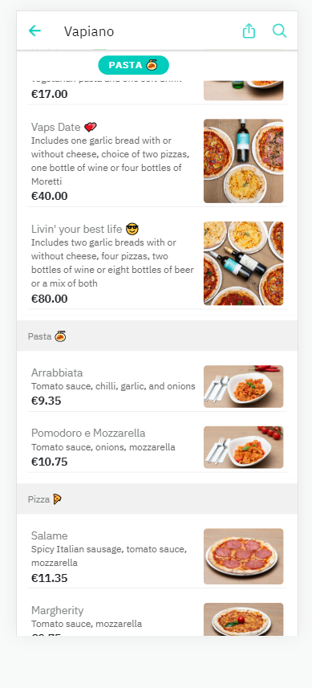

# morellis-angular-ionic-ui

> Frontend UI for the Morellis app, built with Angular 14 and Ionic 6. UI design similar to Deliveroo.

# Commands

- `ionic start morellis-food-ordering blank --type=angular --capacitor`
- `cd morellis-food-ordering`

## Components

- `ionic g module directives/shared/Directives --flat`
- `ionic g directive directives/parallax`
- `ionic g directive directives/hideHeader`
- ` ionic generate page details`

# Images

